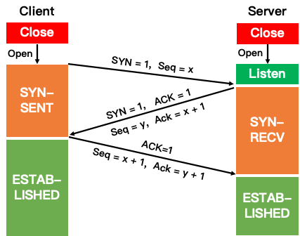

**三次握手**

三次握手是 TCP 连接的建立过程。在握手之前，主动打开连接的客户端结束 CLOSE 阶段，被动打开的服务器也结束 CLOSE 阶段，并进入 LISTEN 阶段。随后进入三次握手阶段：

① 首先客户端向服务器发送一个 SYN 包，并等待服务器确认，其中：

标志位为 SYN，表示请求建立连接；
序号为 Seq = x（x 一般取随机数）；
随后客户端进入 SYN-SENT 阶段。
② 服务器接收到客户端发来的 SYN 包后，对该包进行确认后结束 LISTEN 阶段，并返回一段 TCP 报文，其中：

标志位为 SYN 和 ACK，表示确认客户端的报文 Seq 序号有效，服务器能正常接收客户端发送的数据，并同意创建新连接；
序号为 Seq = y；
确认号为 Ack = x + 1，表示收到客户端的序号 Seq 并将其值加 1 作为自己确认号 Ack 的值，随后服务器端进入 SYN-RECV 阶段。
③ 客户端接收到发送的 SYN + ACK 包后，明确了从客户端到服务器的数据传输是正常的，从而结束 SYN-SENT 阶段。并返回最后一段报文。其中：

标志位为 ACK，表示确认收到服务器端同意连接的信号；
序号为 Seq = x + 1，表示收到服务器端的确认号 Ack，并将其值作为自己的序号值；
确认号为 Ack= y + 1，表示收到服务器端序号 seq，并将其值加 1 作为自己的确认号 Ack 的值。
随后客户端进入 ESTABLISHED。
当服务器端收到来自客户端确认收到服务器数据的报文后，得知从服务器到客户端的数据传输是正常的，从而结束 SYN-RECV 阶段，进入 ESTABLISHED 阶段，从而完成三次握手。

“送礼”		求人办事		一场交易

张三	请	李四帮他办事

| 张三                                                         | 李四                                                         |
| ------------------------------------------------------------ | ------------------------------------------------------------ |
| 先打招呼SYN=1，带点礼Seq=x                                   |                                                              |
|                                                              | 收到来信，礼貌礼貌，回招呼SYN=1，确认礼物收到ACK=1，表明礼物是啥Ack=x+1，回个礼，Seq=y |
| 收到来信，礼物确认送到，ACK=1，给领导讲一下你的礼物我也收到了Seq=y+1 |                                                              |
|                                                              | 收到来信，双方均确认，开始交易                               |
| CLOSED->SYN-SENT->ESTABLISHED                                | CLOSED->LISTEN->ESTABLISHED                                  |

其实本质上，接受消息，先要申请资源，你申请我的时间，我申请你的时间，双方确认，即同步之后，才能正常对话，不然就是你说你的，听不听是你自己的问题。

​						

​																			

**四次挥手：**

四次挥手即 TCP 连接的释放，这里假设客户端主动释放连接。在挥手之前主动释放连接的客户端结束 ESTABLISHED 阶段，随后开始四次挥手：

① 首先客户端向服务器发送一段 TCP 报文表明其想要释放 TCP 连接，其中：

标记位为 FIN，表示请求释放连接；
序号为 Seq = u；
随后客户端进入 FIN-WAIT-1 阶段，即半关闭阶段，并且停止向服务端发送通信数据。
② 服务器接收到客户端请求断开连接的 FIN 报文后，结束 ESTABLISHED 阶段，进入 CLOSE-WAIT 阶段并返回一段 TCP 报文，其中：

标记位为 ACK，表示接收到客户端释放连接的请求；
序号为 Seq = v；
确认号为 Ack = u + 1，表示是在收到客户端报文的基础上，将其序号值加 1 作为本段报文确认号 Ack 的值；
随后服务器开始准备释放服务器端到客户端方向上的连接。
客户端收到服务器发送过来的 TCP 报文后，确认服务器已经收到了客户端连接释放的请求，随后客户端结束 FIN-WAIT-1 阶段，进入 FIN-WAIT-2 阶段。

③ 服务器端在发出 ACK 确认报文后，服务器端会将遗留的待传数据传送给客户端，待传输完成后即经过 CLOSE-WAIT 阶段，便做好了释放服务器端到客户端的连接准备，再次向客户端发出一段 TCP 报文，其中：

标记位为 FIN 和 ACK，表示已经准备好释放连接了；
序号为 Seq = w；
确认号 Ack = u + 1，表示是在收到客户端报文的基础上，将其序号 Seq 的值加 1 作为本段报文确认号 Ack 的值。
随后服务器端结束 CLOSE-WAIT 阶段，进入 LAST-ACK 阶段。并且停止向客户端发送数据。

④ 客户端收到从服务器发来的 TCP 报文，确认了服务器已经做好释放连接的准备，于是结束 FIN-WAIT-2 阶段，进入 TIME-WAIT 阶段，并向服务器发送一段报文，其中：

标记位为 ACK，表示接收到服务器准备好释放连接的信号；
序号为 Seq= u + 1，表示是在已收到服务器报文的基础上，将其确认号 Ack 值作为本段序号的值；
确认号为 Ack= w + 1，表示是在收到了服务器报文的基础上，将其序号 Seq 的值作为本段报文确认号的值。
随后客户端开始在 TIME-WAIT 阶段等待 2 MSL。服务器端收到从客户端发出的 TCP 报文之后结束 LAST-ACK 阶段，进入 CLOSED 阶段。由此正式确认关闭服务器端到客户端方向上的连接。客户端等待完 2 MSL 之后，结束 TIME-WAIT 阶段，进入 CLOSED 阶段，由此完成「四次挥手」。

这个算是一个结束交易		谁先提出来（甲），就必须等待毫无准备的一方（乙），甲收到来信后，甲将合作遗留信息整理之后，发送给你，等乙确认，你先提出来的，别怪我不给你面子，只给你一个LAST-ACK时间等你回复，回复就早点结束，逾期不候。		甲期间必须等待乙处理好，之后才可以结束交易。

|      |      |
| ---- | ---- |
|      |      |

