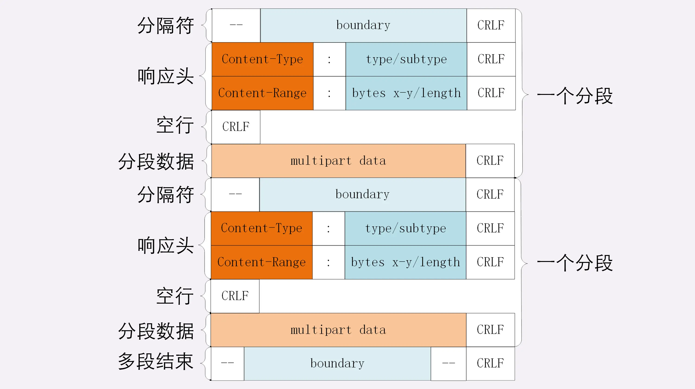

当响应消息中存在 Content-Length 字段时，我们可以直接根据这个值来判断数据是否接收完成，例如客户端向服务器请求一个静态页面或者一张图片时，服务器能够很清楚的知道请求内容的大小，因此可以通过消息首部字段 Content- Length 来告诉客户端需要接收多少数据，但是如果服务器预先不知道请求内容的大小，例如加载动态页面的时候，就需要使用 Transfer-Encoding: chunked 的方式来代替 Content-Length。

分块传输编码（Chunked transfer encoding）是 HTTP/1.1 中引入的一种数据传输机制，其允许 HTTP 由服务器发送给客户端的数据可以分成多个部分，当数据分解成一系列数据块发送时，服务器就可以发送数据而不需要预先知道发送内容的总大小，每一个分块包含十六进制的长度值和数据，最后一个分块长度值为0，表示实体结束，客户机可以以此为标志确认数据已经接收完毕。

响应报文是发给客户端看的啊，服务器肯定知道有多少字节，但是在响应报文中有两种表现形式。

对于小点的文件，直接给出 content-length,也就是本次返回的数据长度
对于大文件，使用 Transfer-Encoding:chunked 字段，不传输数据长度，客户端只知道是分组传输，这也是订好了协议，客户端收到了会进行组装。然后给一个分组传输编码规则的图（借用罗剑锋老师的图）：

